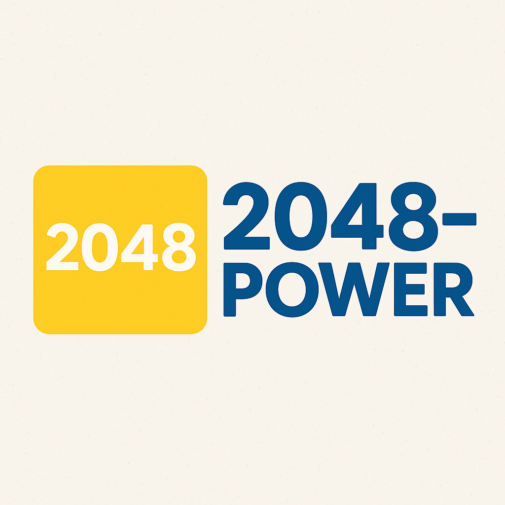

# 🎮 2048-Power



**2048-Power** is the next-generation version of the classic 2048 game — redesigned with stunning visuals, thrilling power-ups, and fully customizable gameplay. Explore a polished user experience and dynamic design to elevate your puzzle-solving strategy!

---

## 📚 Table of Contents

- [✨ Features](#-features)
- [📂 Website Sections](#-website-sections)
- [🛠 Technologies Used](#-technologies-used)
- [🚀 Installation](#-installation)
- [⚙️ Development](#-development)
- [🧩 Customization](#-customization)
- [🤝 Contributing](#-contributing)
- [🪪 License](#-license)
- [📬 Contact](#-contact)

---

## ✨ Features

- 🎨 **Modern UI/UX Design** — Sleek, responsive interface with animations
- 🌌 **Particle Background** — Real-time particle animations for a futuristic vibe
- 📜 **Scroll Animations** — Smooth entrance animations as users scroll
- 📱 **Responsive Layout** — Seamlessly adapts from mobile to desktop
- 🧩 **Interactive Elements** — Hover effects, 3D transforms, and smooth transitions
- 🖼 **Gallery Section** — Highlights gameplay with animated screenshots
- ▶️ **Embedded Demo** — Watch the game in action via an integrated YouTube video

---

## 📂 Website Sections

1. **Hero Section** – Eye-catching introduction and call-to-action buttons  
2. **Features** – Overview of the core mechanics using icons and cards  
3. **Gallery** – Interactive display of game screenshots  
4. **Demo** – Embedded video showcasing the game  
5. **About Developer** – Background info with links  
6. **Development Journal** – External link to full development process  
7. **Call-to-Action** – Final invitation to download/play  
8. **Footer** – Navigation and copyright

---

## 🛠 Technologies Used

- **HTML5** – Semantic structure and layout
- **CSS3** – Styling, animations, and transitions
- **JavaScript** – Basic logic and interactivity
- **Font Awesome** – Iconography
- **Google Fonts** – Custom web typography
- **Processing** – For the game engine (hosted separately)

---

## 🚀 Installation

To run the website locally:

```bash
git clone https://github.com/SarveshwarSenthilKumar/2048-Power.git
cd 2048-Power
```

Then simply open `index.html` in your browser — no server or extra dependencies required!

---

## ⚙️ Development

Built using cutting-edge web standards:

- ✅ CSS Custom Properties (variables)
- ✅ CSS Grid & Flexbox
- ✅ Keyframe animations & transitions
- ✅ Responsive breakpoints
- ✅ 3D transforms & perspective

---

## 🧩 Customization

Make the site your own:

- 🎨 Edit color schemes via `:root` variables in CSS
- 🖼 Replace images in the `/img` folder
- ✏️ Modify content directly in `index.html`
- 🌀 Tweak animations in the stylesheet

---

## 🤝 Contributing

Contributions are welcome! Follow these steps:

```bash
# Fork the repository
# Create a new branch
git checkout -b feature/AmazingFeature

# Commit your changes
git commit -m 'Add some AmazingFeature'

# Push to your branch
git push origin feature/AmazingFeature

# Open a Pull Request
```

---

## 🪪 License

This project is licensed under the **MIT License** — see the [LICENSE](LICENSE) file for details.

---

## 📬 Contact

**Developer:** Sarveshwar Senthil Kumar  
🌐 [Website](https://sarveshwarsenthilkumar.github.io)  
📧 sarveshwar313@gmail.com  
🐙 [GitHub](https://github.com/SarveshwarSenthilKumar)  
💼 [LinkedIn](https://linkedin.com/in/sarveshwarsenthilkumar)

---

> *2048-Power — Taking the classic puzzle game to new heights!*
